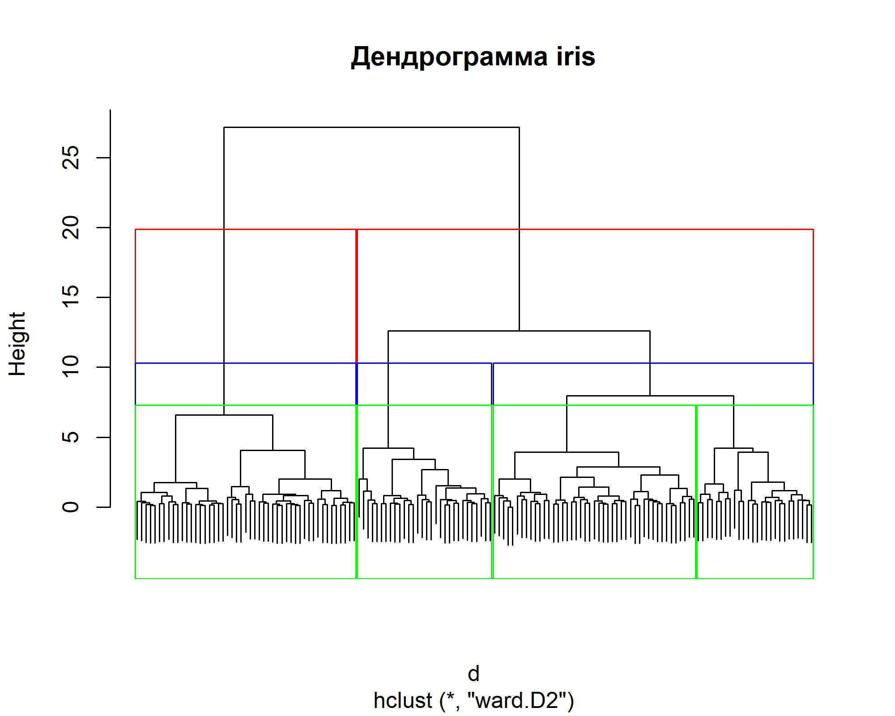
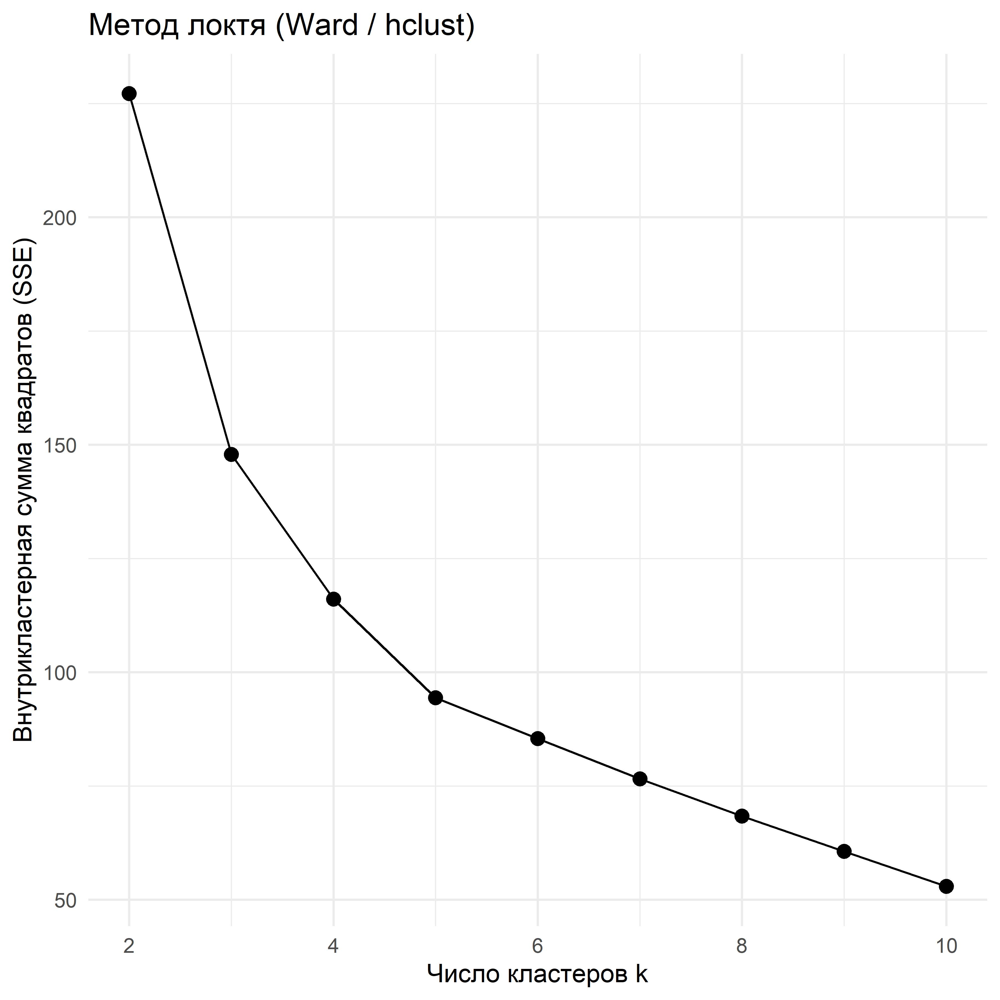
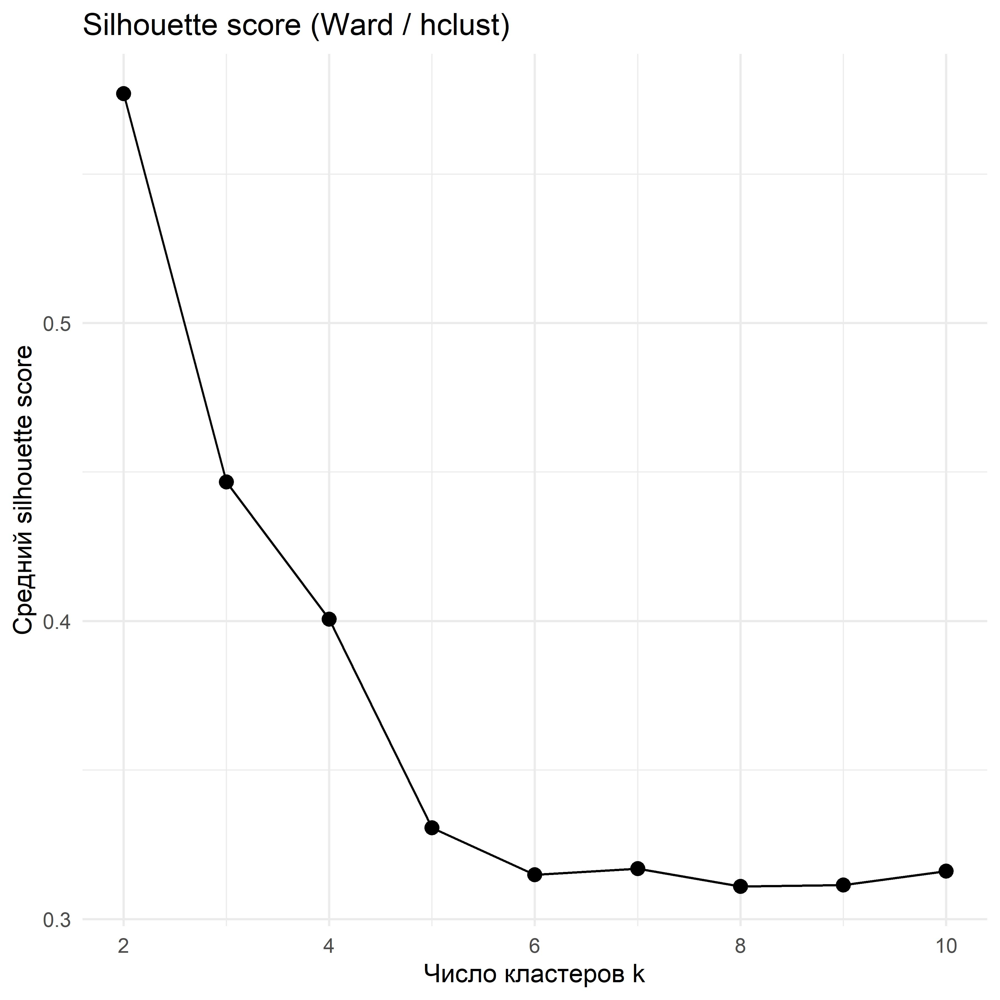
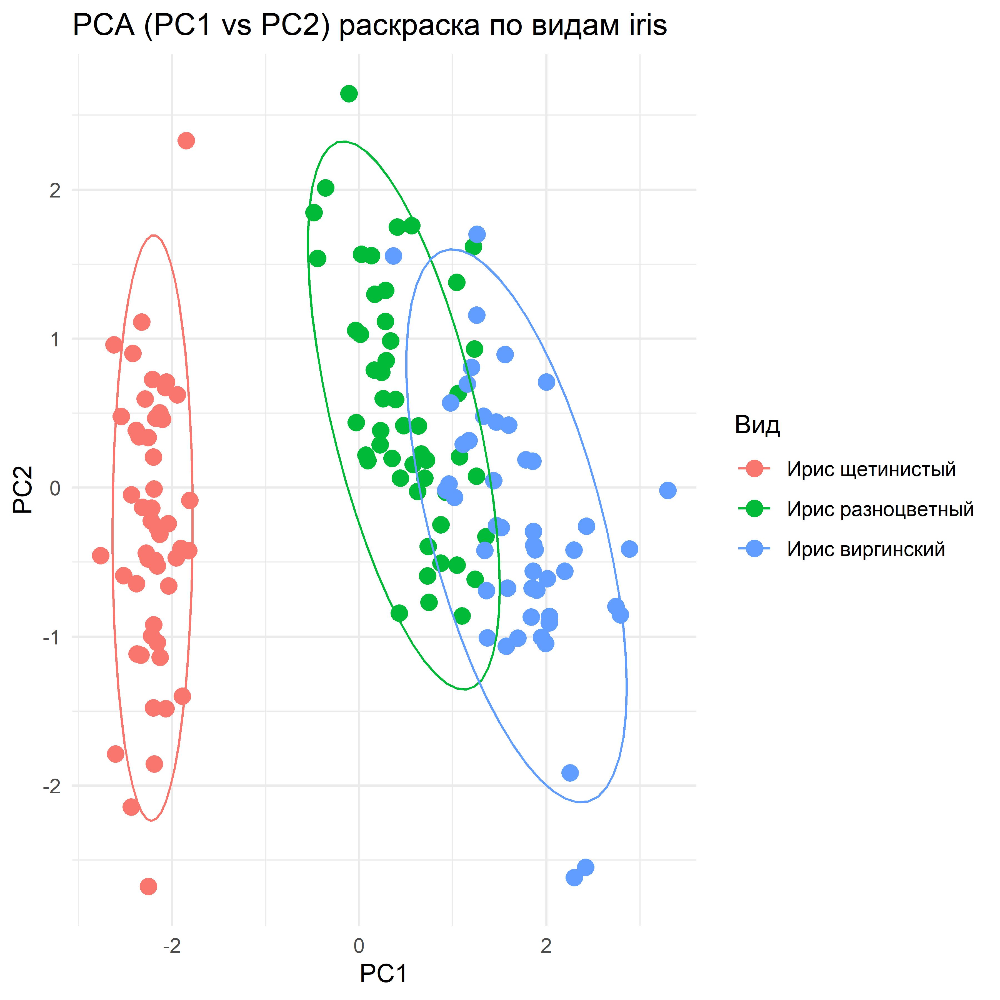
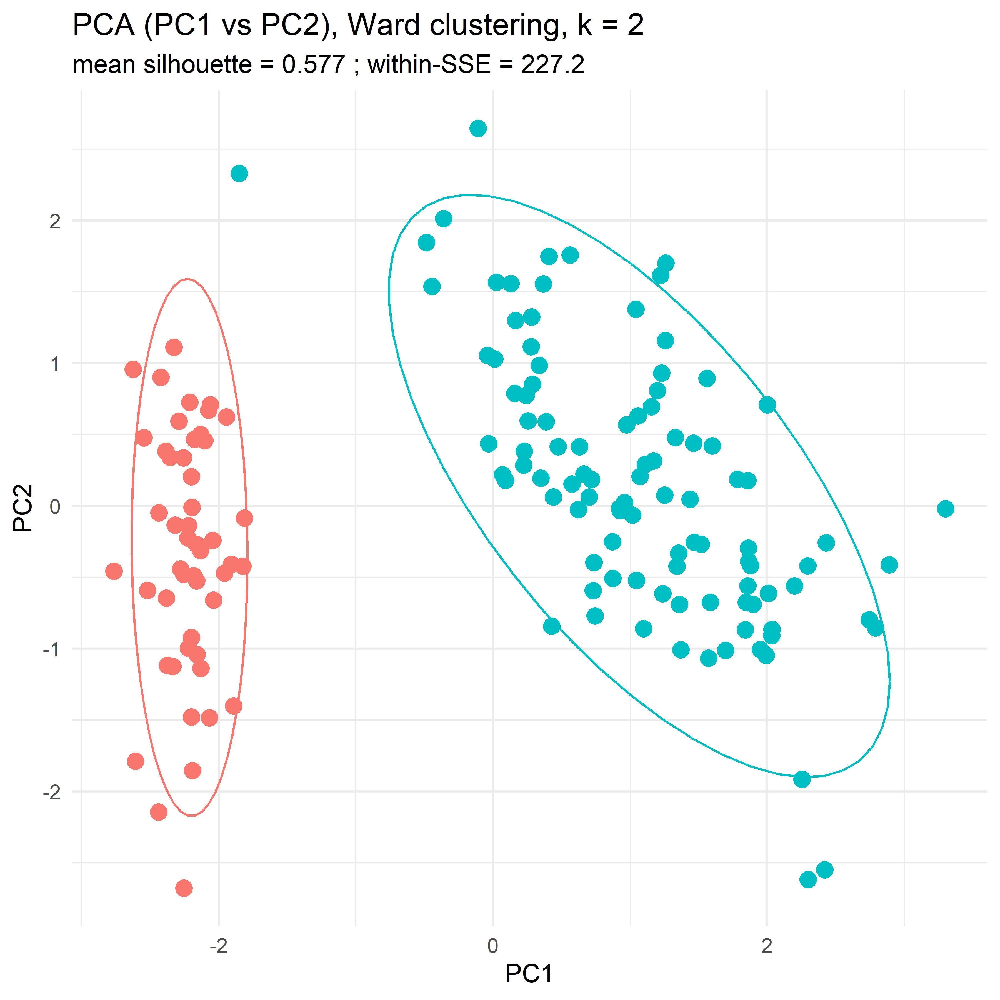
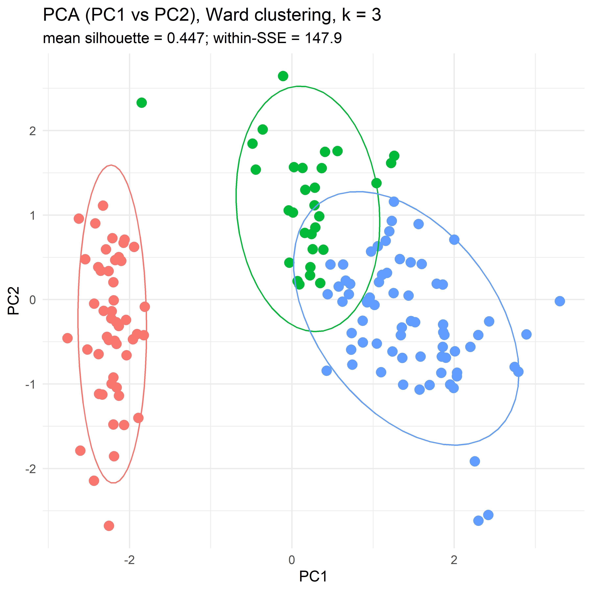
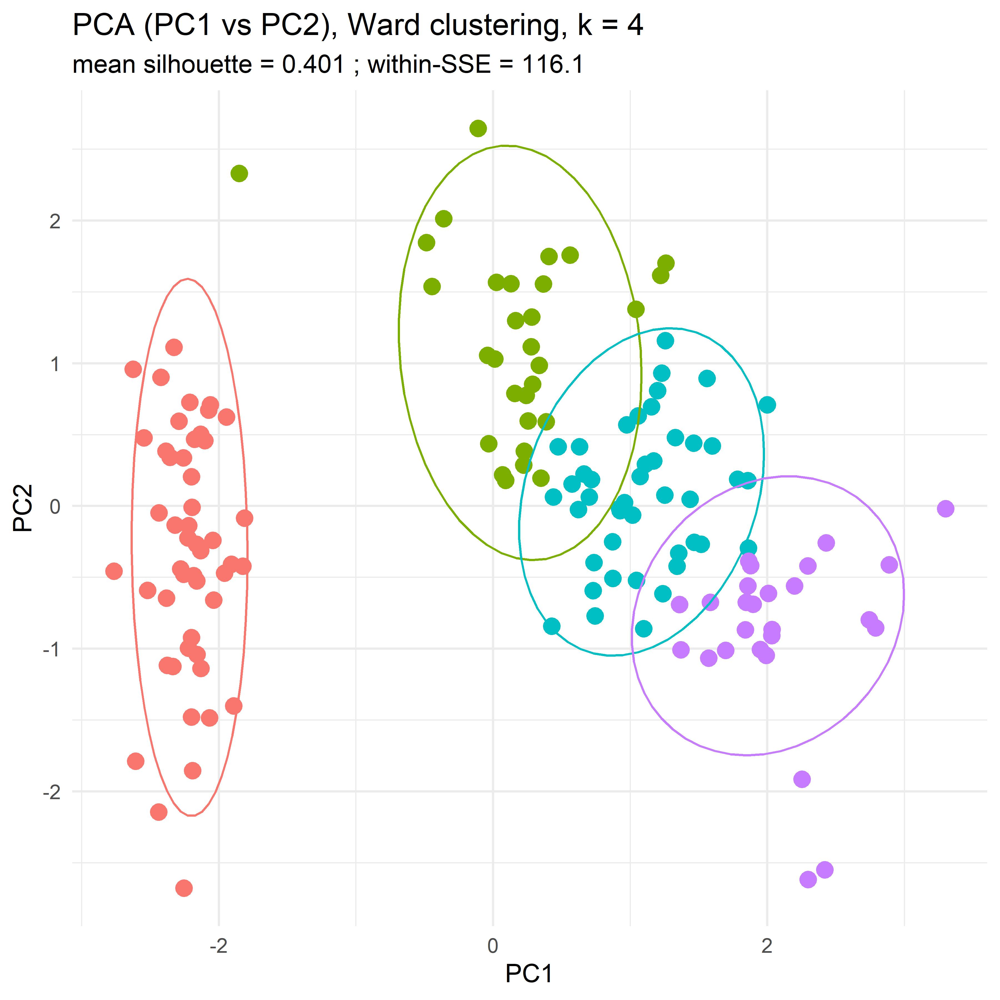

# Дендрограммы и кластерный анализ.

Кластеризация - это способ разделить объекты на группы таким образом, чтобы внутри группы они были максимально похожи друг на друга, а между группами различались как можно сильнее. Иначе говоря, мы пытаемся обнаружить естественную структуру данных, не задавая её заранее.

Это метод обучения без учителя (**unsupervised learning**). В отличие от методов обучения с учителем (**supervised**), такие как классификация, где у нас есть правильные ответы или метки классов и задача алгоритма - научиться их предсказывать, у кластеризации никаких меток нет. Алгоритму не сообщают, сколько существует групп и где проходят границы между ними. Он видит только признаки объектов и пытается организовать их в осмысленные объединения, опираясь на внутреннюю геометрию данных.

По сути, каждый объект можно представить как точку в пространстве признаков. Если признак один, можно ограничиться прямой линией, если два - плоскостью, если признаков четыре - пространство четырёхмерное, если сто - стомерное. И так далее. Дальше вводится мера расстояния, которая определяет, какие объекты считать близкими, а какие далёкими.

Чаще всего используют **евклидово** расстояние - то самое привычное "по прямой", которое мы помним класса с седьмого из школьной геометрии. Но оно далеко не единственное. В зависимости от задачи могут применяться:

### Для числовых признаков

- *манхэттенское расстояние* - сумма различий по координатам;

- *расстояние Минковского* (обобщение евклидового и манхэттенского);

- *косинусное расстояние* - сравнивает направления векторов, а не их длину;

- *расстояние Махаланобиса* - учитывает корреляции между признаками;

### Для категориальных признаков

Там геометрии "по прямой" нет, поэтому используют другие идеи похожести:

- *расстояние Хэмминга* - сколько позиций различаются;

- *расстояние Говера* - удобно для смешанных типов (числа + категории);

- *расстояние Жаккара* (для бинарных признаков)

## Иерархическая кластеризация

В иерархической кластеризации на старте каждый объект считается отдельным кластером. Далее алгоритм шаг за шагом объединяет те кластеры, которые находятся ближе всего друг к другу согласно выбранной метрике расстояния. После каждого объединения количество кластеров уменьшается, а сами они становятся всё крупнее и более обобщёнными. Если довести процедуру до конца, в итоге все объекты окажутся объединены в один общий кластер.

Визуальное представление этой последовательности объединений и есть **дендрограмма** - древовидная схема, показывающая историю "слияний".

<u>Дендрограмму читают снизу вверх</u>. Внизу, на "линии старта", располагаются отдельные наблюдения. Каждая точка соединения ветвей соответствует моменту, когда два кластера были признаны достаточно близкими, чтобы их объединить.

Ключевой элемент здесь - высота соединения. Она отражает расстояние между кластерами в момент их слияния. Если ветви соединились низко - объекты были очень похожи.
Если объединение произошло высоко - различия между ними были существенными.

Алгоритм не пытается угадать *"правильное"* число групп. Его задача - лишь последовательно объединять наиболее близкие структуры. Поэтому выбор количества кластеров всегда остаётся за исследователем.

На практике обычно обращают внимание на **две вещи**.

Во-первых, на **крупные скачки по высоте**. Если несколько объединений происходят низко, а затем внезапно появляется длинный вертикальный разрыв, это может быть естественной границей между кластерами.

Во-вторых, на **интерпретируемость результата**. Полученные группы должны иметь смысл в предметной области - соответствовать клинической логике, биологическим механизмам или исследовательским гипотезам.

## Пример

Рассмотрим на данных [*iris*](https://www.wikidoc.org/index.php/Iris_flower_data_set). Напомню кратко о чём они. Они содержат измерения длины и ширины чашелистиков и лепестков цветков трёх видов ириса: щетинистого, разноцветного и виргинского. В нём 150 наблюдений - по 50 экземпляров каждого вида. Эти замеры проводил сам Рональд Фишер, в далёком 1936 году.

При этом важно принять один момент, который поначалу многих дезориентирует:
на одной и той же дендрограмме можно провести горизонтальную линию на разных уровнях и получить 2, 3 или 4 кластера - и каждый вариант будет математически легитимен. Просто они отвечают на разные уровни детализации структуры данных.

Красные линии соответствуют разделениям на 2 кластера, синие на 3, зеленые на 4.

Есть и другие способы предположить оптимальное число кластеров, основанные уже не на глазомере, а на некой расчётной оценке качества разбиения.

**Метод локтя** использует простую, но мощную идею. Для каждого значения *k* можно посчитать, насколько компактными получаются кластеры, то есть насколько близки объекты к центру своей группы. Чем больше кластеров, тем легче добиться малой ошибки: если сделать кластеров столько же, сколько объектов, ошибка вообще станет нулевой.

Поэтому важно не просто уменьшение ошибки, а темп её уменьшения.

На практике при малых *k* добавление ещё одного кластера резко улучшает картину - группы становятся заметно более однородными. Но начиная с некоторого момента выигрыш становится всё меньше: мы начинаем дробить уже существующие структуры без реального открытия новой организации данных.

Если изобразить эту зависимость на графике, обычно появляется характерный излом - "локоть". Точка перелома интерпретируется как разумный компромисс между простотой модели и точностью описания данных.

По сути, метод локтя - это способ поймать момент, когда дальнейшая детализация перестаёт давать содержательную пользу.

**Силуэтный коэффициент** смотрит на задачу с позиции отдельного объекта.

Для каждого наблюдения можно оценить две величины:
насколько оно близко к членам **своего кластера** и насколько близко к объектам из **ближайшей соседней группы**. Интуитивно: хорошее разбиение предполагает, что внутри своего кластера объект "*чувствует себя дома"*, а до других кластеров ему далеко.

Если разница между этими расстояниями большая, объект классифицирован удачно. Если же он почти одинаково близок и к своим, и к чужим, значит границы между группами размыты.

Силуэтный коэффициент объединяет эту информацию по всем наблюдениям и даёт итоговую оценку качества кластеризации при выбранном *k*. Чем выше значение, тем более компактны кластеры и тем лучше они отделены друг от друга.

Важно, что этот метод оценивает одновременно внутрикластерную плотность и межкластерное разделение, то есть баланс между "своими" и "чужими".

## Визуализации по осям главных компонент

Теперь посмотрим, как полученные группы выглядят в пространстве признаков. Для этого применим метод главных компонент и изобразим объекты на плоскости первых двух компонент - именно они объясняют наибольшую долю вариабельности данных.

На этом графике каждая точка - отдельный цветок, а цвет соответствует его реальному биологическому виду.

Уже здесь заметно, что один класс отделяется очень хорошо, тогда как два других существенно перекрываются.

Теперь раскрасим точки так, как если бы алгоритм выделил 2 кластера.

В подзаголовке указаны коэффициенты качества разбиения. И метод локтя, и силуэтный коэффициент указывают, что вариант с двумя кластерами является наиболее оптимальным с точки зрения геометрии данных, кластеры получаются компактными и хорошо отделяемыми.

Если принудительно разделить данные на 3 кластера, структура становится менее устойчивой.

Объекты начинают дробиться внутри уже существующих групп, а границы между ними становятся менее очевидными.

При четырёх кластерах происходит дальнейшее измельчение структуры без появления принципиально новой организации. Это отражается и в снижении метрик силуэта и локтя.

## Вывод

В проекции на главные компоненты видно два выраженных "облака". Одно из них компактное и хорошо отделено от остальных наблюдений. Второе более растянутое и внутри него заметна неоднородность.

Максимальное значение коэффициентов локтя и силуэта достигается при *k = 2*. Это означает, что именно такое разбиение оказывается наиболее оптимальным с точки зрения взаимных расстояний между объектами: элементы внутри групп близки друг к другу, а между группами - различаются.

Следовательно, по выбранным морфологическим признакам мы уверенно выделяем ирис щетинистый. А вот разделить ирис разноцветный и ирис виргинский алгоритму значительно труднее - в пространстве этих измерений они оказываются геометрически близкими.

И тут спросите вы меня:

>Если три вида, а алгоритм упрямо показывает два кластера, неужели он ошибся?

Кластеризация работает только с числами, с признаками, которые мы ей дали.

И несовпадение с "официальными" ярлыками - не ошибка метода. Это сигнал исследователю: часто различия лежат за пределами выбранных признаков или требуют других измерений.