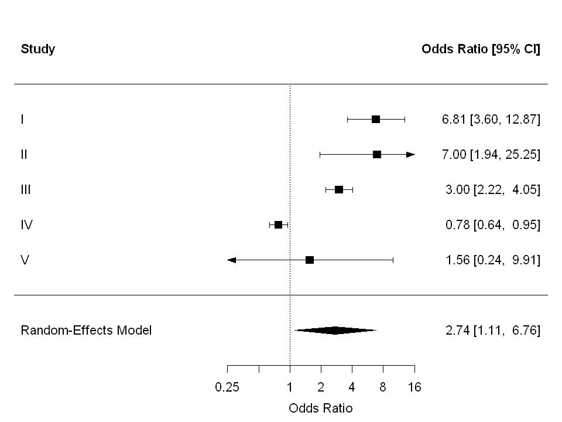

# Forest Plot и мета-анализы

**Forest Plot** - график, без которого практически невозможно представить мета-анализ. Используется когда исследователь хочет не просто перечислить несколько работ по одной теме, а количественно объединить их результаты и увидеть, что показывает каждое исследование по отдельности, насколько эти результаты согласованы между собой и к какому **общему** выводу приводит их совместный анализ.

Название **forest plot** возникло не как строго формальный термин, а скорее как удачная визуальная метафора. Если на таком графике расположено много исследований, горизонтальные линии доверительных интервалов с точками или квадратами оценок действительно начинают напоминать нечто вроде "леса" из деревьев. Со временем это неформальное название закрепилось в научной литературе и стало стандартным термином в биостатистике, эпидемиологии и доказательной медицине.

Важно подчеркнуть, что мета-анализ - это не обзор литературы в привычном смысле, где автор просто пересказывает, кто что написал. Мета-анализ представляет собой количественное объединение результатов нескольких исследований, выполненное по формальным статистическим правилам. Каждое отдельное исследование даёт не просто словесный вывод вроде "эффект есть" или "эффекта нет", а некоторую оценку эффекта и меру её неопределённости. Эта неопределённость обычно выражается через стандартную ошибку, дисперсию или доверительный интервал.

В мета-анализе объединяются не "результаты исследований" как таковые. Объединяются оценки эффекта, выраженные в конкретной статистической шкале. Если шкал несколько - то разные forest plot на шкалу.

Для разных типов исходов используются разные меры эффекта. Для бинарных исходов, таких как умер/выжил, ответил на лечение/не ответил - наиболее распространены *odds ratio* **(OR)** и *risk ratio* **(RR)**. Для исходов типа *time-to-event*, где важно не только наступило ли событие, но и когда именно оно наступило, используется *hazard ratio* **(HR)**. 
Часто эти величины часто воспринимаются как нечто взаимозаменяемое: мол, это просто разные обозначения "силы эффекта". Но такое представление неверно и методологически опасно.

* **Odds ratio (OR)** работает с *шансами* события. Шанс - это не сама вероятность, а отношение вероятности события к вероятности его ненаступления. Например, если вероятность события равна 0.2, то шанс составляет 0.2 / 0.8 = 0.25. *OR* сравнивает именно такие шансы между группами. 

* **Risk ratio (RR)** работает напрямую с *вероятностями*. Он показывает, во сколько раз вероятность события в группе лечения больше или меньше вероятности события в контрольной группе. Поэтому *RR* обычно воспринимается клиницистами и читателями проще: если *RR = 2*, это значит, что событие наблюдается вдвое чаще; если *RR = 0.5*, то вдвое реже.

* **Hazard ratio (HR)** - используется в анализе выживаемости и описывает не просто отношение вероятностей, а *отношение интенсивностей наступления события во времени*. Это особенно важно в исследованиях, где у пациентов разное время наблюдения, есть цензурирование и где само распределение времени до события имеет значение. Поэтому *HR* нельзя понимать как обычный риск, "переведённый в дробь". Это показатель из другой модели, связанный с функцией риска во времени.

Особенно важно понимать, что проблема не сводится только к удобству интерпретации. Дело ещё и в том, что эти меры живут в разных статистических пространствах. В мета-анализе обычно объединяется не сама величина *OR*, *RR* или *HR*, а её логарифм - *log(OR)*, *log(RR)*, *log(HR)* - вместе с соответствующей дисперсией или стандартной ошибкой. Это делается потому, что такие меры имеют более удобные статистические свойства в логарифмической шкале. Но логарифмы *OR*, *RR* и *HR* всё равно остаются логарифмами разных типов эффектов, а не вариантами одной и той же величины.

Обсуждаются ситуации, где возможны приближения или преобразования. Например, при редких событиях OR и RR могут быть численно близки или конвертируемы. Однако это уже не стандартная процедура, а отдельная методологическая задача, требующая явного обоснования и понимания ограничений.

## Элементы forest plot

* **Перечень исследований**
* **Оценка эффекта (например OR)**
  Считается из исходных данных (например $2×2$ таблицы): для OR — как отношение шансов в опытной и контрольной группах. В мета-анализе обычно используется логарифм эффекта $(log(OR))$.
* **Доверительные интервалы (95% CI)**
  Рассчитываются как оценка эффекта ± 1.96 × стандартная ошибка (обычно в логарифмической шкале).
  Затем границы переводятся обратно (например через $\exp$ для **OR**).
* **Вес исследования**
  Определяется через точность оценки: в fixed-модели 

  ($w_i = 1/SE_i^2$), 
  
  в random - 
  
  ($w_i = 1/(SE_i^2 + \tau^2)$).

  Чем меньше стандартная ошибка, тем больше вес.
* **p-value для отдельного исследования**
  Считается через **z-тест**: отношение оценки эффекта к её стандартной ошибке.
  Проверяется гипотеза 
  
  $H_0: \log(OR) = 0$
  
  (то есть OR = 1).

* **Линия отсутствия эффекта**
  Фиксированное значение: для OR/RR это 1, для разностей - 0. Задаётся как нулевая гипотеза.
* **Абсолютные риски (опционально)**
  Считаются как доля событий в группе: успехи / общее число.
  Добавляются для интерпретации, не участвуют в объединении.
* **Итоговая оценка эффекта (ромб снизу)**
  Считается как взвешенное среднее эффектов: 
  
  $\hat{\theta} = \sum w_i \theta_i / \sum w_i$.

  Доверительный интервал - через стандартную ошибку общего эффекта.
* **Модель мета-анализа (fixed / random)**
  Fixed предполагает один истинный эффект, random - распределение эффектов с дисперсией ($\tau^2$).
  Выбор модели влияет на веса и итоговую оценку.
* **p-value общего эффекта**
  Считается через **z-тест** для объединённой оценки: отношение общего эффекта к его $SE$.
  Проверяется 
  
  $H_0: \hat{\theta} = 0$ 
  
  (например OR = 1).

* **Тест Кокрейна на гетерогенность ($Q$)**
Считается как сумма взвешенных отклонений эффектов от общего: 

$Q = \sum w_i(\theta_i - \hat{\theta})^2$

Проверяет гипотезу:

$H_0:$ *все исследования имеют один и тот же истинный эффект*

Сравнивается с ($\chi^2$)-распределением ($df = k − 1$) для получения **p-value**.
* **$I²$**
  Считается из $Q$: доля вариации, не объясняемая случайной ошибкой.
  Формула: 
  
  $I^2 = \max(0, (Q - df)/Q) \cdot 100%$
  

* **$\tau^2$**
  Оценка межисследовательской дисперсии, например методом ДерСимониана–Лэрда.
  Используется в random-effects для пересчёта весов.

## Игрушечный пример

Изучаем действие нового слабительного препарата при хроническом запоре.
Исход бинарный: либо успех есть, либо нет.

Под успехом будем понимать: за последние сутки стул состоялся.

Проведено 5 независимых исследований.
Они отличаются по размеру выборки, соотношению групп и, как следствие, по точности оценок и вкладу в итоговый результат.

| Исследование | Опыт (успех / всего) | Контроль (успех / всего) |
|---|---|---|
| I   | 63 / 100  | 20 / 100  |
| II  | 35 / 40   | 10 / 20   |
| III | 300 / 500 | 100 / 300 |
| IV  | 250 / 1000 | 300 / 1000 |
| V   | 4 / 10    | 3 / 10    |

Средствами пакета `metafor` в R строим **forest plot**.

## Как его читать

Каждая строка - отдельное исследование.

Квадрат в строке - точечная оценка эффекта, в данном случае **Odds Ratio** для конкретного исследования.

Горизонтальная линия через квадрат - 95% доверительный интервал.
Чем линия длиннее, тем меньше точность оценки.

Вертикальная пунктирная линия - линия отсутствия эффекта, здесь это $OR = 1$.
Если доверительный интервал пересекает 1, эффект статистически не значим.

Ромб внизу - общий эффект.
Его центр - итоговый **OR**, ширина - 95% доверительный интервал общего эффекта.

Поскольку доверительный интервал общего эффекта не пересекает 1, общий результат статистически значим.

Но здесь есть важный нюанс. Мой игрушечный пример наглядно показывает, что исследования не вполне согласованы между собой.

Большинство исследований указывают на пользу препарата, но:

- IV исследование показывает эффект в обратную сторону, 
- V исследование очень "маленькое", интервалы заметно различаются по ширине.

То есть формальный общий вывод положительный, но данные не идеально однородны.
Именно для таких ситуаций и нужны показатели гетерогенности вроде $Q$ и $I^2$: они количественно оценивают, насколько исследования расходятся между собой.

**Вывод:**

Большая часть исследований указывают на преимущество нового слабительного препарата над контролем, и объединённый эффект мета-анализа также находится в пользу опытной группы. Однако исследования неоднородны: одно из них демонстрирует эффект в противоположную сторону, а одно даёт крайне неточную оценку. Следовательно, общий положительный результат есть, но интерпретировать его нужно с учётом гетерогенности между исследованиями.